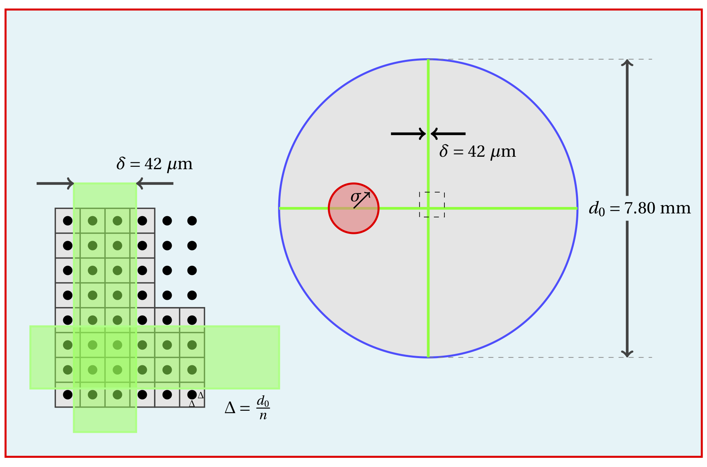

# Summary

`QuadCellDetector` is a python package that allows one to simulate the response of a quadrant cell photodiode to the passage of a Gaussian laser beam across its surface. Quadrant cell photodiodes (as the name implies) are silicon photodiodes split into four quadrants (with a small gap separating each quadrant). The detector geomety parameters are shown in  Another quadrant cell detector variety has a square shape (see, for example [@square-photodiode]), but this package does *not* implement this square geometry. 

Typically, the photocurrent from each 

# Acknowledgements

We thank Kallee Gallant for drawing the figures in Tikz! 

# References
